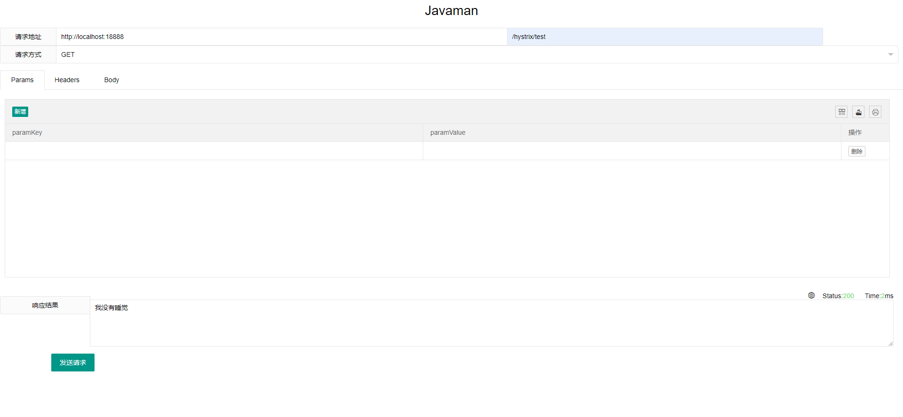
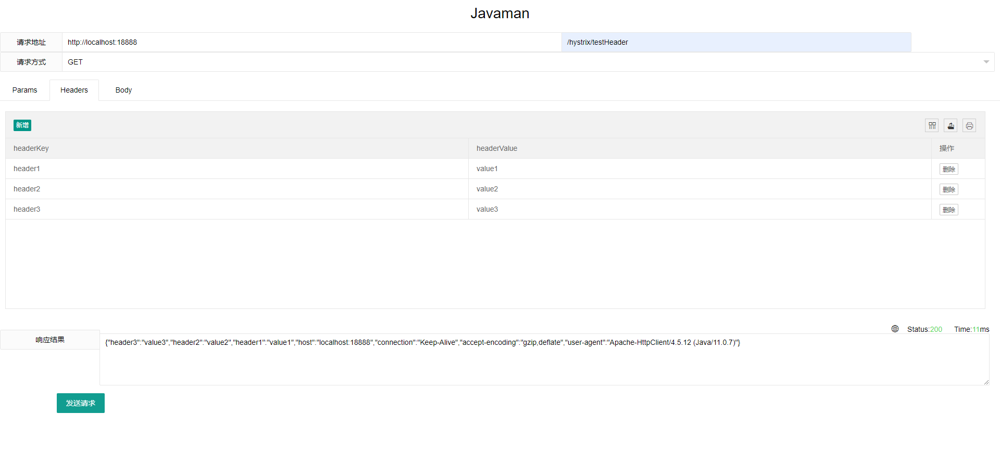
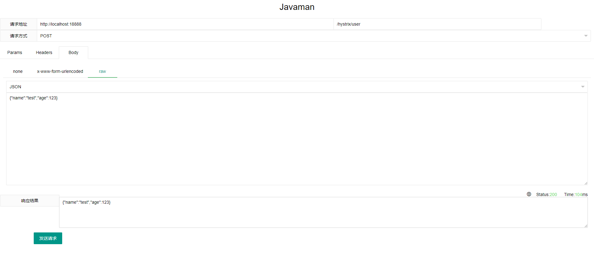
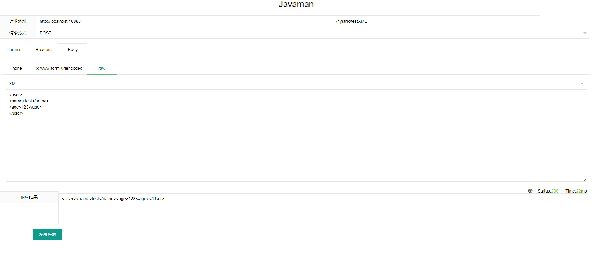

# javaman

#### 介绍
使用httpclient在Web端发送http请求
### 支持请求方式
* GET
* POST
* PUT(待实现,可扩展)
* DELETE(待实现,可扩展)
* ...

### POST参数类型
* Text
* JSON
* XML
* ...

#### 发送GET请求

#### 携带请求头

#### 发送POST请求 json类型

#### 发送POST请求 xml类型

